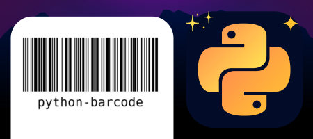

# Python Barcode - Geração de código de barras


<p align="center">
<kbd>
  
</kbd>
</p>

## 👨‍🚀 Projeto

Essa aplicação é um Backend desenvolvido em Python durante a **Next Level Week - Expert** para a geração de etiquetas de códigos de barras de produtos, com ele é possível gerar o código de barras do tipo `CODE 128`

## 🚀 Tecnologias

- [Python](https://www.python.org/): Linguagem de programação de alto nível, orientada a objetos e funcional utilizada para desenvolver essa aplicação
- [Flask](https://flask.palletsprojects.com/en/3.0.x/): Micro-Framework utilizado para a criação da aplicação web, usada como Backend
- [Python-Barcode](https://pypi.org/project/python-barcode/): Biblioteca usada para a criação das imagens dos códigos de barras
- [Pre-commit](https://pre-commit.com/): Framework utilizado para que antes de salvar o commit no Git, seja verificado problemas dentro da aplicação
- [Git](https://git-scm.com/): Sistema de versionamento de código utilizado para controlar as versões da aplicação

## 🌕 Iniciar a aplicação

```bash
# Baixar os pacotes da aplicação
pip install requirements.txt

# Ativar as variáveis ambientes do Python (Windows)
./.venv/Scripts/activate

# Rodar a aplicação em python no modo DEBUG
python run.py

# (não é necessário) Gerar as dependências dos pacotes da aplicação (Windows)
./.venv/Scripts/pip freeze > requirements.txt
```

> Para ver como ativar o ambiente virtual do python (venv) em outras plataformas e sistemas operacionais, acesse <https://docs.python.org/pt-br/dev/library/venv.html#how-venvs-work>

A aplicação estará disponível na porta 3000 (localhost:3000). Para gerar um código de barras, utilize o método POST no seguinte endpoint: `http://localhost:3000/create_tag`. Só é necessário enviar no endpoint uma requisição com o seguinte documento JSON no *body*:

```json
{
    "product_code": "123-231-213"
}
```

Também é possível via cURL:

```bash
curl --location --request POST '<http://localhost:3000/create_tag>' \
--header 'Content-Type: application/json' \
--data-raw '{
    "product_code": "123-231-213"
}'
```

Será retornado na *response* o seguinte documento JSON, contenho o caminho da imagem de código de barras gerada:

```json
{
    "data": {
        "count": 1,
        "path": "123-231-213.png",
        "type": "Tag Image"
    }
}
```

## 🧪 Testes unitários

Para a execução dos testes unitários da aplicação, foi utilizado a biblioteca **pytest**. Para a visualização destes testes, basta executar o seguinte comando no terminal:

```bash
# executar os testes dad aplicação
pytest

# executar os testes e visualizar todos os testes individualmente no terminal
pytest -s -v
```

<h3 align="center">
    Feito com ☕ por <a href="https://github.com/Brendon3578"> Brendon Gomes</a>
</h3>
